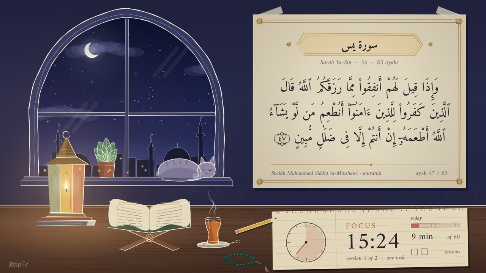

# Study With Me — 1 hour Qur'an recitation (Pomodoro 25/5)

A calm, hand-drawn "study with me" video for **@jip7e**. The scene is a night study desk by an arched window. It has a crescent moon that crosses the sky over the hour, a lit fanous lantern, an open mushaf on a rehal, tea with rising steam and a sleeping cat on the sill. A parchment card shows the **Arabic text of each ayah as it is recited**, and a notebook on the desk keeps a **Pomodoro timer (25 min focus / 5 min break, twice)**.



- **Reciter:** Sheikh Muhammad Siddiq Al-Minshawi, *murattal*. Slow, clear and calm, which suits studying.
- **Surahs:** the build takes Ya-Sin, Ar-Rahman, Al-Waqi'ah, Al-Mulk, Al-Insan, An-Naba, … in mushaf order and keeps each one that still fits in the 60 minutes. The exact list depends on the real audio lengths, and the build prints it.
- **Length:** 12 s intro + 60:00 session + 16 s outro, 1920×1080, 24 fps, H.264 + AAC.
- **Style:** made with the [hand-drawn-canvas-animation](https://github.com/alesha-pro/tools/tree/main/skills/hand-drawn-canvas-animation) skill (Canvas 2D). The room draws itself on during the intro and then holds as one drawing. Only living things move: the flame, steam, stars, clouds, the cat's breathing, the moon, the card and the timer. Motion runs at 12 drawings/s, the skill's "on twos" cadence. It is quiet and not distracting.

## Make the video (one command)

You need **Node.js 20+** (https://nodejs.org). Chrome and ffmpeg are installed automatically by `npm install`.

```bash
cd quran-study
npm install
npm run build
```

`npm run build` runs these three steps. You can also run them one at a time:

| step | command | what it does | time |
|---|---|---|---|
| 1 | `npm run audio` | downloads the per-ayah MP3s from everyayah.com (cached in `audio/`, resumable) | 1–3 min |
| 2 | `npm run timeline` | decodes every ayah, measures it to the sample, picks the surahs that fit, and writes the soundtrack and the ayah timings | ~1–2 min |
| 3 | `npm run render` | renders all frames in parallel headless Chrome and muxes the recitation | ~15–40 min, depending on your CPU |

The render is **resumable**. If it stops, run `npm run render` again and it continues from the last finished 2-minute chunk. Use `--workers N` to set the number of CPU workers, or `--width 2560` / `--width 3840` for 1440p/4K.

### What you get in `out/`

| file | use |
|---|---|
| `quran-study-with-me.mp4` | the video to upload |
| `thumbnail.jpg` | 1280×720 thumbnail (`npm run render -- --thumb`) |
| `youtube-description.txt` | ready-to-paste description with credits and chapters |
| `youtube-chapters.txt` | the chapter timestamps on their own |
| `youtube-title-ideas.txt` | a few title options |

### Check before rendering the hour (optional)

```bash
npm run preview                       # stills at key moments + out/preview/contact.jpg
npm run render -- --clip 600,30       # 30 s clip with sound starting at 10:00
node scripts/build-timeline.mjs --mock   # estimated timings, no audio needed (previews only)
```

The film can also be scrubbed in a browser. Run any static server in `film/` (for example `npx http-server film`) and open `study.html`.

## Upload checklist

1. Upload `out/quran-study-with-me.mp4`, then set the thumbnail to `out/thumbnail.jpg`.
2. Paste `out/youtube-description.txt`. It already includes the chapters, which YouTube detects from the timestamps, and the required credits.
3. Category: *Education*. Altered or synthetic content: *No*. The visuals are drawn animation, and the audio is a real recitation.
4. Play the first ayahs after upload to check that the text on the card stays in sync with the voice.

## About copyright (please read)

- **Recitation:** almost no famous reciter has a written free-use licence. Sheikh al-Minshawi (d. 1969) recorded these murattal recitations decades ago. They are shared freely by Islamic sites such as EveryAyah and are very widely used in YouTube Qur'an and study videos. The chance of a Content ID claim is low but **not zero**. A claim usually means ad revenue goes to the claimant or the video is muted in some countries. It is not a copyright strike. If you ever need a different voice, change `reciter.everyayahFolder` in `config.json` to another EveryAyah folder (e.g. `Husary_128kbps`, `Abdul_Basit_Murattal_192kbps`, `Ghamadi_40kbps`, `Hani_Rifai_192kbps`) and rebuild. Avoid Mishary Alafasy and Omar Hisham, who actively claim uploads.
- **Qur'an text:** from the [Tanzil Project](https://tanzil.net) (Uthmani, v1.1), shown **verbatim**, under CC BY 3.0. The description credits Tanzil with a link, as its licence requires. On screen, the basmala is shown on its own line when it is recited separately, and the words themselves are never changed.
- **Font:** Amiri Quran by Khaled Hosny, SIL Open Font License (`film/fonts/OFL-Amiri.txt`).
- **Animation engine:** hand-drawn-canvas-animation by Alexey Fateev, MIT (`film/LICENSE-hand-drawn-canvas-animation.txt`).
- **Music:** none. The soundtrack is only the recitation.

## Customise

All settings are in `config.json`:

- `surahCandidates`: surahs to use, in order. Any that don't fit the session are skipped.
- `sessionMinutes`, `pomodoro.focusMinutes`, `pomodoro.breakMinutes`: for example 120 minutes with 50/10.
- `reciter`: the EveryAyah folder and the name shown on the card. Set `prependBasmala: false` if a reciter's ayah-1 files already contain the basmala.
- `surahNames`: English spellings shown on the card and in the chapters.
- `video`: `crf` (quality: lower means better and bigger), `preset`, `width`.

After changing `config.json`, run `npm run timeline` and then `npm run render -- --fresh`.

## Project layout

```
quran-study/
  config.json              session, reciter, surahs
  film/study.html          the film: drawings, scenes, card, timer (Canvas 2D)
  film/core.js             the hand-drawn-canvas-animation engine (unchanged copy)
  film/data/               Tanzil Uthmani text (verbatim) + surah metadata, with Tanzil's notice
  film/fonts/              Amiri Quran / Amiri (OFL)
  film/timeline.js         generated: ayah timings and the text on screen
  scripts/fetch-audio.mjs  step 1
  scripts/build-timeline.mjs  step 2
  scripts/render.mjs       step 3 (+ --preview, --clip, --thumb)
```
